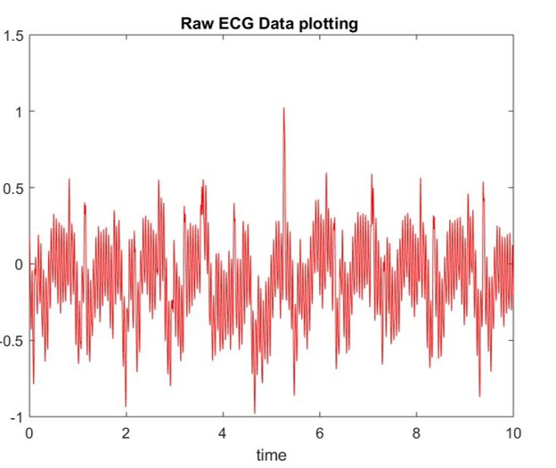
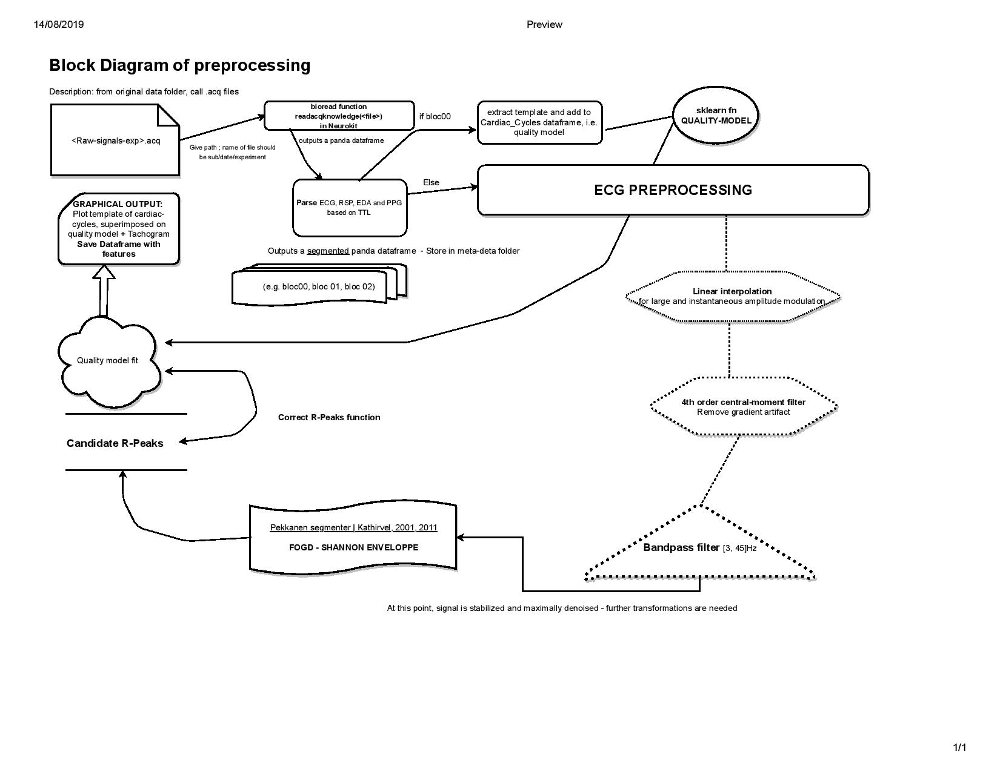

# Preprocessing pipeline for ECG signals recorded in fMRI #

This repo details the different preprocessing steps required for denoising and amplification of target signal. 
The aim of this pipeline is to describe signal quality using operational criterions that will clssify the signal as usable or unusable. As part of Courtois-Neuromod project, this repo will eventually be merged to the project's GitHub. 

## TODO LIST ##
- [x] start a .md file that summarizes the intent of and principal refs for the project
- [x] build flow chart of preprocessing steps
- [ ] detail each step of the flow chart with .md file in "scripts" directory
- [ ] start clean jupyter notebook with the code I know is needed and will stay
	- [ ] import packages
	- [ ] import test data
	- [ ] key definition of panda object returned by readacqknowledge function (bioread repo)
	- [ ] basic parsing of time series
- [ ] add draft notebooks in which I test specific filter design
- [ ] save parsed data in pickle

## Python packages used ##
Of course, the use of numpy, pandas, pickle, seaborn, and matplotlib is imperative for data organization and vizualisation.
Specific packages include
* __Neurokit__ [docs](https://www.neurokit.readthedocs.io/en/latest/)
* __BioSPPy__ [docs](https://www.biosppy.readthedocs.io/en/stable/)

## Sources of interference to cancel out ##

### 1. fMRI - gradient artifacts ###
ECG signals recorded in fMRI are principally polluted by gradient artifacts related to the radio-frequency pulse and magnetism of scanner. Echo-planar imaging (brain imaging) uses Gradient-Echo sequences that often include multi-band factor (i.e. multiple slices at a time). Simple maths for a 60-slices sequence with multi-band factor of 4 and 1,490s repetition time : 60/4 = 15 shots per TR. How many gradients are there per TR? 15/1490 = 10.067. So approximately 100ms separate adjacent gradients.

**This can be handled with 4th order central-moment filter** 

[Reference on this filter design](https://www.ncbi.nlm.nih.gov/pubmed/28981438/)

### 2. Impulsive noise/sudden large shifts in amplitude ###

Other noises include muscle contractions, movements, moving cables. 
**This can be handled by linear interpolation and non linear transformations**

## Preprocessing algorithm and necessary package modification ##

