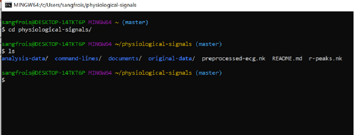
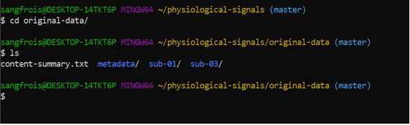
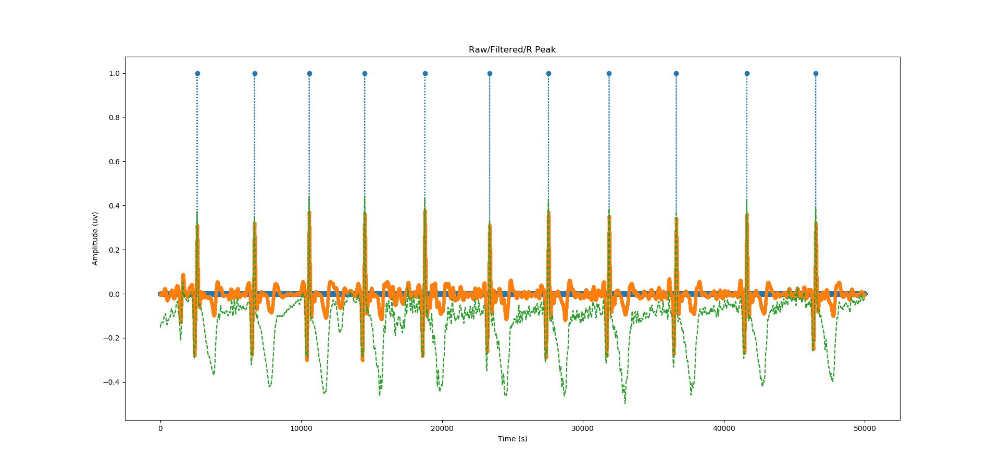
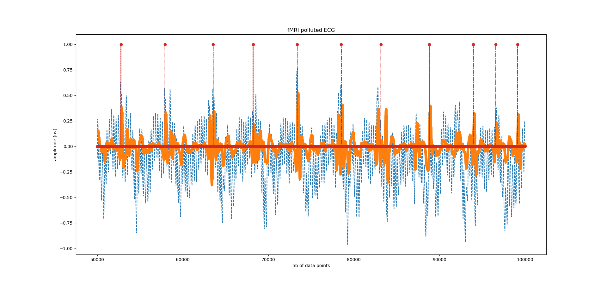

# Learning to manipulate biosignals with python
#### Warning : the requirements.txt contains packages that are unnecessary. I use to do everything with the same env. 

## High-Level summary
The intent of my brainhack project was to lay down the necessary steps to manipulate biosignals as python objects, with a special regard to preprocessing ECG recorded in fMRI setting. While learning about collaborative coding, I wanted extend my knowledge of the different tools for data organization and visualization. I have learned to organize my code such as I can compare the performance of different filter designs in a readable manner.

## Project definition
Once I was at ease with the fundamental commands of my environment and python's basic syntax, I explored a package made explicitly for biosignal analysis. My question was straight-forward: How could I measure the performance of different filtering techniques. I also wanted to measure how these filters altered the detection accuracy for heart beats. During week 2, I studied [Neurokit](https://neurokit.readthedocs.io/en/latest/) extensively. I tried different filter types and segmentation algorithms (which correspond to syntactic rules that corrects for improbable peak detection). A visualization of outputs and summary of next steps can be found [here](sripts/test-signal-quality.ipynb). Week 3, I tried to make an interactive figure with plotly graph objects. My aim was intuitively visualise a subgroup of detected cardiac cycles. I wanted to keep the waveforms that deviated the most from the emperically defined model of cardiac cycles and scroll through observation with my application. [Here](scripts/plotly-dash-visualisation.ipynb). Week 4, I studied pandas package extensively. I wanted to parse the biosignals file in multiple blocks corresponding to when the brain is being scanned. I constructed a sequential search algorithm to find blocks of the experiment where the trigger channel has high values.

## Results

### First accomplishment - environment - GitBash 
I managed to build a centralized environment on Windows by making my conda shell available for gitbash through a .profile file in my home directory. I also organized folders following TIERs protocol . I also made sure that my physiological data could be BIDS compatible later on during the school . [BIDS for physio](https://bids-specification.readthedocs.io/en/stable/04-modality-specific-files/06-physiological-and-other-continuous-recordings.html). 

### Second accomplishment - scheme and project definition - JupyteLab
I intended to build a flow chart of my future preprocessing pipeline by using DrawIO extension of jupyterlab. The file is [here](scripts/untitled.dio). I intended to systematize my project through a markdown in order to describe the necessary steps to take in order to have ready for analyses biosignals. This can be found [here](project-scheme.md). A draft of these to-be-assemble parts of the preprocessing pipeline can be found in a [notebook](scripts/biosignal-pipeline.ipynb)

### Third accomplishment - filtering techniques comparison - Neurokit
The evaluation of the signal's quality is essential to describe the performance of filtering techniques. The peculiarity of gradient artefacts on ECG signals makes it difficult to only keep the pertinent information (heart beat waveform). **1**  **2** 

**Legend** : Here, we can visualize the effect of a *Finite Impulse Response filter* using nonlinear transformations to verify the peak detection first implemented by [Kathirvel et al.2001](http://link.springer.com/article/10.1007/s13239-011-0065-3/fulltext.html). One can appreciate of detection accuracy differs from a signal to another.

**(1)** _No strong magnetic interference_ **Orange is filtered, Green is raw, blue dashed lines is detection**.
**(2)** _Gradient artefacts present_ **Orange is filtered, Blue is raw, Red dashed lines is detection**

_I also have tried to design a filter that uses higher order statistics to reduce gradient artefacts contribution to the signal_ [here is a script that helps me keep track of my attempts using my ipython console](scripts/test-for-filterDesign.py)

#### In python notebook : test-signal-quality - Neurokit
Find in [test-signal-quality.ipynb](scripts/test-signal-quality.ipynb) basic manipulation of Neurokit package objects - ECG dict. This dict object contains features of the signal such as the time index of heart beats and cardiac cycles (which are basically 600 ms snapshots of the signal around the detected peak). This matrix of cardiac-cycles observations can then be compared to a machine learning model of standard database -- note that a model like this can be built for an individual. 

### Fourth accomplishment - plotly viz
A dash application could then be used to scroll through a subgroup of cardiac-cycles observations that deviates strongly from the learned model. [Here](scripts/dash-plotly-visualisation.ipynb), I was only able to build the app's skeleton, i.e. It scrolls through all observed cardiac-cycles instead of the subgroup per se. I would like to go further and build a lineplot-like figure that includes a confidence interval around the mean cardiac-cycle waveform.

### Fifth accomplishment - data parsing - PANDAS
A sequential search algorithm to parse the signals can be found under [test-parsing-signal.ipynb](scripts/test-parsing-signal.ipynb). This notebook queries the dataframe returned by a function that read .acq files (propriatery files for BIOPAC instruments). The query looks for values of 5 in the TTL channel (trigger channel that reflects RF pulse). My algorithm searches for difference between two timestamps values (timedeltas) larger than the TR. That way, I keep parsing time points in a list, that are later used to segment the uncut biosignals. These blocks could then be dumped in pickle format. Block0 should correspond to the segment before the scanner is turned on. That way, a clean segment could be kept to build a individualized template of heart beat waveform.
